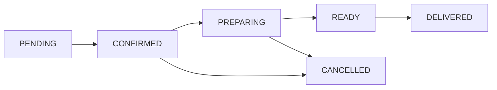

# RestaurantHub 🍽️

Sistema de gestión integral para restaurantes multi-cadena construido con **Spring Boot** y **Clean Architecture**. Un proyecto de práctica que implementa **12 patrones de diseño** de forma práctica y escalable.

## 🚀 Características Principales

- **Multi-restaurante**: Gestión de diferentes tipos de cocina y formatos
- **Menús dinámicos**: Customización flexible de platos y categorías
- **Procesamiento de órdenes**: Estados automáticos con notificaciones en tiempo real
- **Sistema de roles**: Control de acceso granular (Cliente, Empleado, Admin)
- **Pagos integrados**: Adapter para múltiples proveedores de pago
- **Analytics**: Reporting automático de ventas e inventario

## 🏗️ Arquitectura

### Clean Architecture + Hexagonal
```
src/main/java/com/restauranthub/
├── application/          # Casos de uso y lógica de aplicación
│   ├── services/         # Servicios de aplicación
│   ├── ports/           # Interfaces (puertos)
│   └── usecases/        # Casos de uso específicos
├── domain/              # Lógica de negocio pura
│   ├── entities/        # Entidades del dominio
│   ├── valueobjects/    # Objetos de valor
│   ├── repositories/    # Contratos de repositorios
│   └── events/          # Eventos del dominio
├── infrastructure/      # Adaptadores externos
│   ├── persistence/     # JPA, repositorios
│   ├── web/            # Controllers REST
│   ├── external/       # APIs externas
│   └── messaging/      # Sistema de eventos
└── config/             # Configuración Spring
```

## 🎯 Patrones de Diseño Implementados

### Creacionales
| Patrón | Implementación | Ubicación |
|--------|---------------|-----------|
| **Factory Method** | Creación de diferentes tipos de restaurantes | `domain/factories/RestaurantFactory` |
| **Builder** | Construcción de menús y órdenes complejas | `domain/builders/MenuBuilder` |
| **Prototype** | Clonado de platos base para variaciones | `domain/entities/Dish` |

### Estructurales
| Patrón | Implementación | Ubicación |
|--------|---------------|-----------|
| **Adapter** | Integración con APIs de pago externas | `infrastructure/external/PaymentAdapter` |
| **Facade** | Simplificación de operaciones de órdenes | `application/services/OrderFacade` |
| **Proxy** | Control de acceso por roles | `infrastructure/web/SecurityProxy` |
| **Decorator** | Ingredientes y toppings dinámicos | `domain/decorators/DishDecorator` |
| **Composite** | Estructura jerárquica de menús | `domain/entities/MenuComponent` |

### Comportamiento
| Patrón | Implementación | Ubicación |
|--------|---------------|-----------|
| **Observer** | Notificaciones de estado de órdenes | `domain/events/OrderEventSystem` |
| **Strategy** | Algoritmos de cálculo de precios | `domain/strategies/PricingStrategy` |
| **State** | Estados del procesamiento de órdenes | `domain/states/OrderState` |

## 🛠️ Stack Tecnológico

- **Framework**: Spring Boot 3.2
- **Base de datos**: PostgreSQL (H2 para testing)
- **ORM**: Spring Data JPA
- **Seguridad**: Spring Security
- **Testing**: JUnit 5, Mockito, TestContainers
- **Documentación**: OpenAPI 3 (Swagger)
- **Build**: Maven
- **Containerización**: Docker

## 📋 Requisitos

- Java 17+
- Maven 3.8+
- Docker (opcional)
- PostgreSQL (opcional, usa H2 por defecto)

## 🚀 Instalación y Ejecución

### Desarrollo Local
```bash
# Clonar repositorio
git clone https://github.com/tu-usuario/restauranthub.git
cd restauranthub

# Ejecutar con perfil de desarrollo (H2)
mvn spring-boot:run -Dspring-boot.run.profiles=dev

# O con PostgreSQL
mvn spring-boot:run -Dspring-boot.run.profiles=prod
```

### Docker
```bash
# Construir imagen
docker build -t restauranthub .

# Ejecutar con docker-compose
docker-compose up -d
```

### Acceso a la aplicación
- **API**: http://localhost:8080
- **Swagger UI**: http://localhost:8080/swagger-ui.html
- **H2 Console**: http://localhost:8080/h2-console (dev profile)

## 📚 API Endpoints

### Restaurantes
```http
GET    /api/v1/restaurants          # Listar restaurantes
POST   /api/v1/restaurants          # Crear restaurante
GET    /api/v1/restaurants/{id}     # Obtener restaurante
PUT    /api/v1/restaurants/{id}     # Actualizar restaurante
```

### Menús
```http
GET    /api/v1/restaurants/{id}/menu    # Obtener menú
POST   /api/v1/restaurants/{id}/dishes  # Agregar plato
PUT    /api/v1/dishes/{id}             # Actualizar plato
```

### Órdenes
```http
POST   /api/v1/orders                  # Crear orden
GET    /api/v1/orders/{id}            # Obtener orden
PUT    /api/v1/orders/{id}/status     # Actualizar estado
GET    /api/v1/users/{id}/orders      # Órdenes por usuario
```

## 🧪 Testing

```bash
# Tests unitarios
mvn test

# Tests de integración
mvn test -Dtest=**/*IntegrationTest

# Coverage report
mvn jacoco:report
```

## 📁 Estructura del Proyecto

### Entidades Principales
- **Restaurant**: Factory Method para diferentes tipos
- **Menu/Dish**: Builder y Prototype para variaciones
- **Order**: State pattern para estados
- **User**: Roles y permisos con Proxy
- **Payment**: Adapter para diferentes proveedores

### Casos de Uso
- Gestión de restaurantes y menús
- Procesamiento de órdenes con estados
- Sistema de notificaciones
- Cálculo de precios con descuentos
- Control de inventario

## 🔄 Estados de Órdenes



## 💡 Casos de Uso de Patrones

### Factory Method
```java
// Diferentes tipos de restaurantes
RestaurantFactory.createRestaurant(RestaurantType.FAST_FOOD);
RestaurantFactory.createRestaurant(RestaurantType.FINE_DINING);
```

### Builder
```java
// Construcción fluida de menús
Menu menu = Menu.builder()
    .name("Breakfast Menu")
    .addCategory("Hot Beverages")
    .addDish("Espresso", 2.50)
    .build();
```

### Observer
```java
// Notificaciones automáticas
order.addObserver(new EmailNotificationObserver());
order.addObserver(new SMSNotificationObserver());
order.updateStatus(OrderStatus.READY);
```

## 🎯 Objetivos de Aprendizaje

Este proyecto está diseñado para practicar:
- ✅ Clean Architecture en aplicaciones reales
- ✅ Implementación práctica de patrones GoF
- ✅ Principios SOLID
- ✅ Testing comprehensivo
- ✅ API REST design
- ✅ Manejo de eventos y estados
- ✅ Integración con servicios externos

## 🤝 Contribución

Este es un proyecto de práctica personal, pero sugerencias y feedback son bienvenidos:

1. Fork el proyecto
2. Crear feature branch (`git checkout -b feature/nueva-funcionalidad`)
3. Commit cambios (`git commit -m 'Agregar nueva funcionalidad'`)
4. Push al branch (`git push origin feature/nueva-funcionalidad`)
5. Abrir Pull Request

## 📈 Roadmap

### Fase 1: Foundation ✅
- [x] Setup inicial y arquitectura
- [x] Patrones creacionales (Factory, Builder, Prototype)
- [x] Entidades básicas

### Fase 2: Integration ✅
- [x] Patrones estructurales (Adapter, Facade, Proxy)
- [x] APIs externas y seguridad

### Fase 3: Behavior ✅
- [x] Patrones de comportamiento (Observer, Strategy, State)
- [x] Sistema de eventos

### Fase 4: Polish ✅
- [x] Decorator y Composite
- [x] API REST completa
- [x] Documentación y deployment

### Futuras mejoras 🚀
- [ ] WebSocket para notificaciones en tiempo real
- [ ] Cache distribuido con Redis
- [ ] Metrics con Prometheus
- [ ] Frontend con React/Vue
- [ ] Microservicios con Spring Cloud

## 📄 Licencia

MIT License - ver [LICENSE](LICENSE) para más detalles.

## 🙋‍♂️ Autor

**Tu Nombre**
- GitHub: [@tu-usuario](https://github.com/tu-usuario)
- LinkedIn: [Tu Perfil](https://linkedin.com/in/tu-perfil)

---

⭐ Si este proyecto te fue útil, considera darle una estrella en GitHub!
